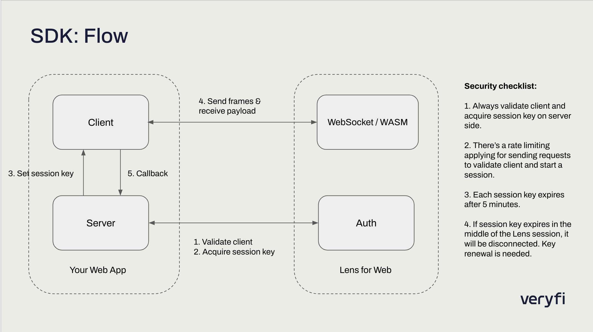

[](https://opensource.org/licenses/MIT)

# Veryfi Lens for Web SDK Demo

Veryfi Lens for Web SDK is a framework for your web app to give it document capture superpowers in minutes.

This project is an example to showcase how you can integrate Lens SDK into your web app using vanilla js and node.




To get started, first make sure you have a valid credentials in `index.js`:

```
const CLIENT_ID = "YOUR_CLIENT_ID_HERE"; // make sure to keep them as a secret
const API_KEY = "YOUR_API_KEY";
const USERNAME = "YOUR_USERNAME";
```

To start the app on port 3000:
```
npm start or node server.js
```

